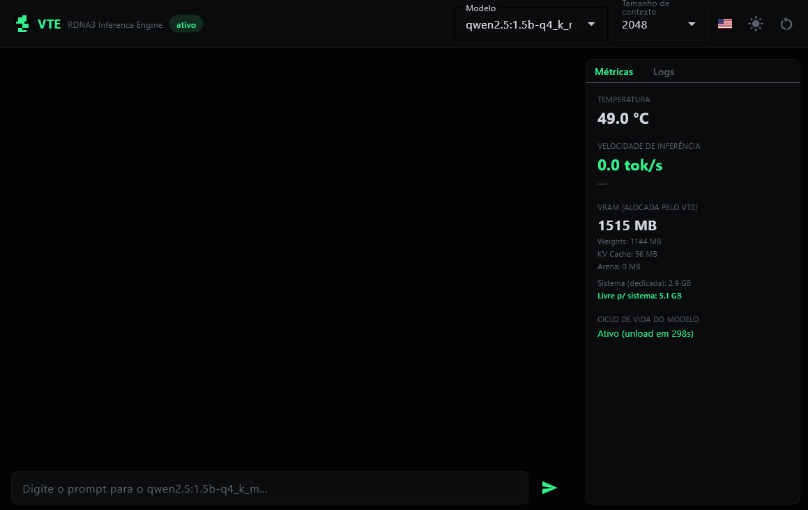
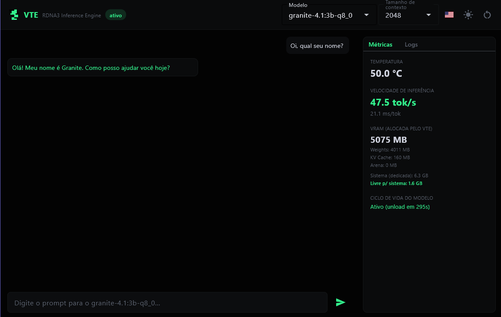
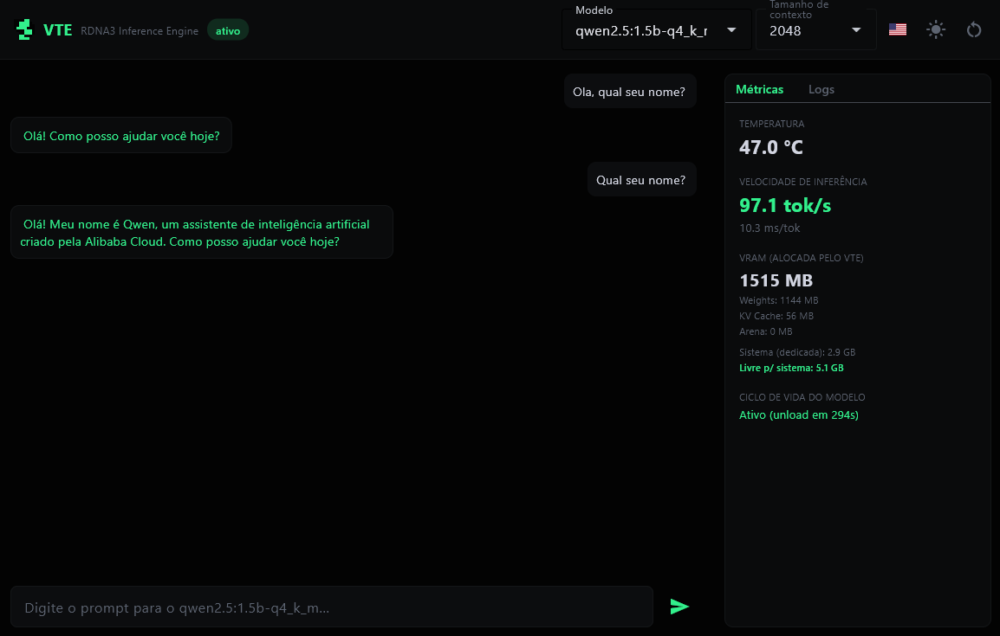

<p align="center">
  
</p>

<h1 align="center">VTE: Vector Tensor Engine</h1>

<p align="center">
  A from-scratch LLM inference engine for AMD GPUs on Windows.<br>
  No llama.cpp. No PyTorch. No ONNX Runtime. Just HIP, GGUF, and a lot of measurement.
</p>

<p align="center">
  
  
  
  
</p>

---

VTE parses the GGUF file itself, generates the HIP C++ kernels itself, compiles them with `hipcc` (or loads a precompiled binary shipped with the project. See [Quick start](#quick-start)), and drives `amdhip64.dll` through a hand-written ctypes bridge. It currently runs three architectures: **Qwen2.5-1.5B-Instruct** (Q4_K_M/Q6_K), **IBM Granite 4.1 3B** (Q8_0), and **Qwen3.5 2B** (Q6_K), selectable at runtime, and the whole project has been developed and measured on a single consumer card: an RX 7600 (RDNA3, gfx1102, 8GB VRAM).

The reason to build this from scratch was to have full control over every byte moved between VRAM and the ALUs on a GPU that has neither the memory bandwidth nor the CU count of a datacenter part, and to make every optimization decision based on an actual measurement on this specific hardware, not on what works on an MI300X or an RTX 4090. That discipline ("measure, don't guess") shows up throughout the codebase and is documented in [Bugs found during development](docs/BUGS.md).

## The other goal: surfacing and working around real ROCm/Windows gaps on consumer RDNA3

Running LLM inference on an AMD consumer GPU through ROCm/HIP on Windows is, as of this writing, still rough in ways that show up constantly in the community, not as hypothetical edge cases:

- **RDNA2 GPUs are frequently not even enumerated by ROCm on Windows**, independent of any specific app; reported against current Adrenalin/ROCm releases ([ROCm/ROCm#6167](https://github.com/ROCm/ROCm/issues/6167), [#5871](https://github.com/ROCm/ROCm/issues/5871)), with dual-booting Linux or waiting for the next driver as the only suggested workarounds.
- **The exact card this project is built on (RX 7600, gfx1102) has a documented ROCm/HIP/KFD-stack hang** in another inference engine: 100% GPU utilization, zero tokens produced, indefinitely, while the *same build* with a different backend (Vulkan) runs fine, confirming the fault is in the ROCm/HIP layer itself, not the calling application ([ROCm/TheRock#5793](https://github.com/ROCm/TheRock/issues/5793)).
- **A driver update can silently break the ROCm runtime's own hardware survey on Windows**, hanging with `0 GPUs` detected until an older Adrenalin build is reinstalled ([lmstudio-bug-tracker#1906](https://github.com/lmstudio-ai/lmstudio-bug-tracker/issues/1906)).
- **Unsupported-GPU users route around missing official support with `HSA_OVERRIDE_GFX_VERSION`**, telling the runtime a card is a *different*, supported architecture and hoping the ISA is close enough, rather than anything that adapts to the real hardware.

None of that is solvable from outside ROCm's own stack, and VTE doesn't attempt to patch ROCm itself: it sidesteps the layers where these reports keep originating, and every design choice below came from hitting one of these classes of problem firsthand during development, not from reading about them:

- **No dependency on the parts of the stack that keep hanging or failing to enumerate hardware.** VTE never calls into `rocBLAS`/`MIOpen`/the ROCm runtime's device-enumeration path at all: it talks straight to `amdhip64.dll` through its own ctypes bridge (`vte/bridge/hip_runtime.py`) and reads the GPU's real name/CU count itself at startup, the same category of check the linked ROCm issues show silently failing for other tools.
- **Architecture detection and kernel scaling are read from the real device at runtime, not hardcoded or overridden.** `get_gpu_architecture()` + `GPU_ARCH_MAP` (`vte/config.py`) and `HIPRuntime.get_num_cus()` size every kernel launch off the actual card present: the same problem the community's `HSA_OVERRIDE_GFX_VERSION` hack works around by lying to the runtime, solved here by not needing to lie in the first place (see [Known limitations: Hardware portability](docs/LIMITATIONS.md#hardware-portability)).
- **A real Windows TDR crash was hit, root-caused, and fixed inside this project**: a single large synchronous `hipMemcpy` was enough to make Windows/WDDM consider the GPU hung; `weight_loader.py` now chunks every host→device upload into ≤16MB pieces specifically to avoid it (see [Bugs found during development](docs/BUGS.md) and [Architecture: notes for AMD/ROCm reviewers](docs/ARCHITECTURE.md#notes-for-anyone-reviewing-this-from-an-amdrocm-perspective)).
- **A `KernelWatchdog` and a duty-cycle limiter exist specifically because this is a shared desktop GPU, not a dedicated accelerator**: a hung kernel triggers a safe panic instead of a hard hang, and sustained utilization is deliberately kept under 100% so the rest of the user's desktop stays responsive, neither of which ROCm/HIP itself provides on Windows today.
- **`hipcc` doesn't find MSVC/Windows SDK headers on its own on Windows**, a friction point independent of any GPU-specific bug, so precompiled kernels ship with the project for the tested/cross-compiled architectures specifically to make MSVC Build Tools unnecessary for the common case (see [Quick start](#quick-start)).

The throughput numbers below are the headline result, but the more transferable finding for anyone else targeting consumer RDNA3 through HIP on Windows is arguably this: a project that had to build its own safety net under a stack that regularly hangs, crashes, or fails to enumerate hardware for other people on the exact same class of GPU.

As of this writing, single-sequence decode holds a **stable ~113 tok/s on Qwen2.5-1.5B**, and batched decode peaks at **~200 tok/s aggregate** at batch size 4. Both climbed from a ~41 tok/s baseline mostly through profiling and removing overhead, plus one real GEMV kernel rewrite (Thesis V6) that closed part of a measured memory-bandwidth gap. IBM Granite 4.1 3B and Qwen3.5 2B run correctly in VRAM and reach similar throughput ratios vs. llama.cpp/Ollama. Full numbers below.

## Screenshots

<p align="center">
  
  
  
</p>

<p align="center"><sub>Chat panel (left) + live GPU telemetry dashboard (right): temperature, tok/s, VRAM breakdown (weights/KV cache/arena), and model lifecycle, all real numbers read from the GPU, not placeholders (see <a href="docs/LIMITATIONS.md#telemetry-and-desktop-ui">Known limitations</a>).</sub></p>

## Benchmark: VTE vs. Ollama (llama.cpp)

Same GGUF files on disk for both engines, same prompt, `temperature=0`, decode-only timing (full methodology in [Performance](docs/PERFORMANCE.md)):

| Model | VTE | Ollama (llama.cpp) | VTE / Ollama |
|---|---|---|---|
| Qwen2.5 1.5B (Q4_K_M) | **112.98 tok/s** | 110.76 tok/s | **102.0% (VTE faster)** |
| Qwen2.5 7B (Q4_K_M) | 39.60 tok/s | 42.71 tok/s | 92.7% |
| Granite 4.1 3B (Q8_0) | **55.65 tok/s** | 50.84 tok/s | **109.5% (VTE faster)** |
| Qwen3.5 2B (Q6_K) | 69.00 tok/s | 77.00 tok/s | 89.6% |

The code doing the dispatching here is **Python**, not C++, driving every HIP launch through ctypes, and landing at 84%+ of a mature, years-tuned C++ engine's throughput (beating it on two of four models) is the evidence for this project's core bet: dispatch overhead is a solvable engineering problem, not a language tax. The 7B is the largest model registered so far and shows the widest gap, likely more per-token cost shifting into shared GEMV/FFN kernels as the model grows, not yet profiled to confirm. See [Performance](docs/PERFORMANCE.md#benchmark-vte-vs-ollama-llamacpp) for the full write-up.

The Qwen2.5 rows reflect a later kernel-level fix (Thesis V6, see [Performance](docs/PERFORMANCE.md#thesis-v6-achieved-bandwidth-driven-gemv_q4k-optimization-2026-07)) that measurably improved `gemv_q4k` throughput: the VTE side was re-measured with the exact same prompt/token-count/`temperature=0` methodology as the rest of this table, but the Ollama numbers are from the earlier run and have not been re-verified since, so the VTE/Ollama ratio for these two rows is not a freshly matched comparison on both sides.

## Quick start

The fastest way to talk to a model is the desktop UI (chat + live GPU telemetry).

<table>
<tr><td>

**Requirements**
- Windows 10/11, 64-bit
- AMD RDNA3 GPU (RX 7000 series)
- [HIP SDK (ROCm 6.4–7.1 tested)](https://www.amd.com/en/developer/resources/rocm-hub/hip-sdk.html): **[MSVC Build Tools](https://visualstudio.microsoft.com/pt-br/downloads/?q=build+tools) only needed for an unrecognized GPU**: precompiled kernels ship with the project for gfx1102 (RX 7600, tested on real hardware) and gfx1100/gfx1101 (RX 7900/7600 XT/7700/7800 series, compiled offline, never run on real hardware of that generation, see [Limitations](docs/LIMITATIONS.md)). Anything VTE doesn't recognize falls back to compiling kernels locally, which does need MSVC Build Tools
- Python 3.10+, ~8GB VRAM
- A `.gguf` model in `Model/`: any GGUF of a supported architecture (Qwen2.5, Granite, Qwen3.5) works, not just the three pre-tested ones below; see [Getting started](docs/USAGE.md#where-models-go)

</td><td>

**Install and run**
```bash
python -m venv .venv
.venv\Scripts\activate
pip install -e .[dev]
vte-ui
```

</td></tr>
</table>

`pip install -e .[dev]` registers `vte` as an editable package (`import vte` and `vte-ui` work from anywhere afterward). Pick the model from the dropdown in the app. Switching between Qwen, Granite, and Qwen3.5 at runtime, mid-session, is supported (see [Multi-architecture support](docs/GRANITE.md)).

If `vte-ui` isn't on `PATH`, `python -m vte.ui.app` is the equivalent. To install VTE as a library without cloning: `pip install git+https://github.com/kyuubyN/VTE.git`. Adding a model is just copying a `.gguf` into `Model/`: no code changes, no registry to edit (see [Getting started](docs/USAGE.md#where-models-go)). Full requirements list, Python API examples, and desktop-UI details: [Getting started](docs/USAGE.md).

## Documentation

The full write-up is split by topic: each page is self-contained and links back here.

| Page | What's in it |
|---|---|
| [**Performance**](docs/PERFORMANCE.md) | Stage-by-stage optimization history (18.8 → 100 tok/s), batched decode, the full VTE-vs-Ollama benchmark, and what was tried and rejected |
| [**Architecture**](docs/ARCHITECTURE.md) | How `vte/bridge`, `vte/compiler`, `vte/core`, and `vte/ui` fit together; why QKV fusion is on but FFN fusion is off; notes for AMD/ROCm reviewers |
| [**Multi-architecture support**](docs/GRANITE.md) | Adding Granite 4.1 3B: the RoPE convention bug, the `residual_scale` scoping bug, and the Flet UI's model-switch race conditions |
| [**Qwen 3.5 (hybrid Gated DeltaNet)**](docs/QWEN35.md) | Adding a hybrid recurrent-attention architecture: the FP16-read-as-float32 bug that caused "oi" to degenerate into garbage, the missing QK-Norm/gate architecture piece, and the streaming/thinking-mode bugs found via real UI testing |
| [**Bugs found during development**](docs/BUGS.md) | The full "symptom → root cause → fix → measurement" history: silent data corruption, a real Windows TDR crash, and everything in between |
| [**Known limitations**](docs/LIMITATIONS.md) | What's genuinely unfinished or unresolved right now |
| [**Getting started**](docs/USAGE.md) | Full Python API examples and desktop-UI setup details |
| [**Integrating with Lemonade**](docs/LEMONADE.md) | `vte-server`'s API surface and safety fallbacks, `vte pull`, the Lemonade-side recipe, the `recipe_options.ctx_size` gotcha, and the release process |
| [**ROCm / RDNA3 architecture reference**](docs/ROCm/README.md) | Original notes on WGP/CU/SIMD, LDS/GDS, the memory hierarchy, wave32/64, and the HIP programming model, distilled from AMD's official documentation |
| [**Security policy**](SECURITY.md) | Threat model and defense mechanisms (untrusted GGUF input, VRAM sandboxing, watchdogs) |

---

<p align="center">VTE (Vector Tensor Engine) · 2026 · Licensed under Apache 2.0</p>
